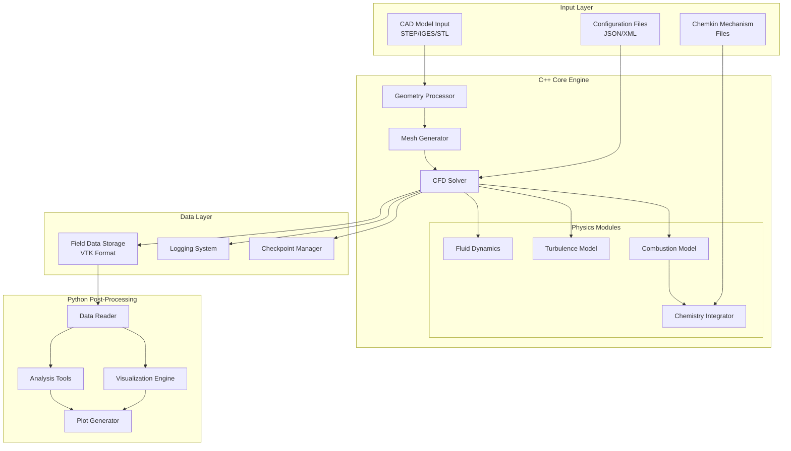
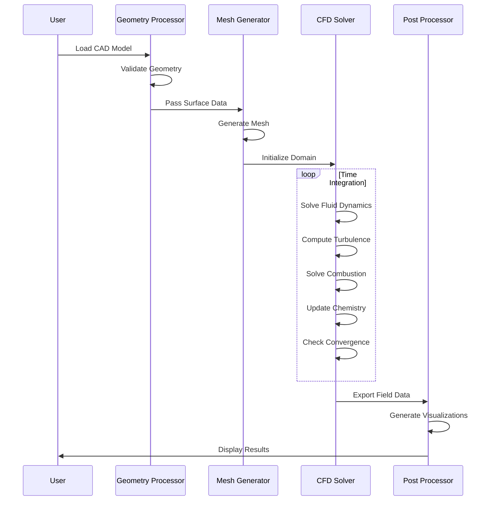

# CFD Combustion Engine Simulation System - Design Document

## Overview

The CFD combustion engine simulation system is a high-performance computational framework for analyzing internal combustion engine behavior with ethanol-gasoline fuel blends. The system follows a modular architecture with three primary components: a C++ core for geometry processing, mesh generation, and physics simulation; a chemistry integration layer for Chemkin mechanism handling; and a Python post-processing suite for visualization and analysis.

The design emphasizes computational efficiency through parallel processing, numerical accuracy through validated algorithms, and extensibility through well-defined interfaces between components.

## Architecture

### System Architecture Diagram



### Component Interaction Flow



## Components and Interfaces

### 1. Geometry Processor

**Purpose**: Import and validate 3D CAD models, extract boundary surfaces

**Key Classes**:
- `GeometryReader`: Abstract base class for CAD format readers
  - `STEPReader`: STEP file format handler
  - `IGESReader`: IGES file format handler
  - `STLReader`: STL file format handler
- `GeometryValidator`: Checks manifold surfaces, closed volumes
- `BoundaryExtractor`: Identifies and tags boundary surfaces

**Interfaces**:
```cpp
class GeometryReader {
public:
    virtual bool loadFile(const std::string& filename) = 0;
    virtual std::vector<Surface> getSurfaces() const = 0;
    virtual BoundingBox getBounds() const = 0;
    virtual bool validate() const = 0;
};

class GeometryValidator {
public:
    bool checkManifold(const std::vector<Surface>& surfaces);
    bool checkClosedVolume(const std::vector<Surface>& surfaces);
    std::vector<GeometryError> getErrors() const;
};
```

**Dependencies**: OpenCASCADE for STEP/IGES, standard STL parsing

### 2. Mesh Generator

**Purpose**: Create computational mesh from validated geometry

**Key Classes**:
- `MeshGenerator`: Main mesh generation controller
- `TetMesher`: Unstructured tetrahedral mesh generation
- `BoundaryLayerMesher`: Prismatic boundary layer mesh
- `MeshQuality`: Mesh quality assessment and reporting
- `AdaptiveMeshRefiner`: Dynamic mesh refinement

**Interfaces**:
```cpp
class MeshGenerator {
public:
    void setGeometry(const std::vector<Surface>& surfaces);
    void setMeshParameters(const MeshParams& params);
    bool generate();
    Mesh getMesh() const;
    MeshQualityMetrics getQualityMetrics() const;
};

struct MeshParams {
    double baseSize;
    double boundaryLayerHeight;
    double growthRatio;
    int numBoundaryLayers;
    std::vector<RefinementRegion> refinementRegions;
};

class Mesh {
public:
    std::vector<Node> nodes;
    std::vector<Cell> cells;
    std::vector<Face> faces;
    std::map<std::string, BoundaryPatch> boundaries;
};
```

**Dependencies**: CGAL or TetGen for mesh generation

### 3. CFD Solver Core

**Purpose**: Orchestrate multi-physics simulation, time integration

**Key Classes**:
- `CFDSolver`: Main solver controller
- `TimeIntegrator`: Temporal discretization and time stepping
- `LinearSolver`: Sparse matrix solver (conjugate gradient, GMRES)
- `FieldManager`: Storage and access for field variables
- `BoundaryConditionManager`: Apply boundary conditions

**Interfaces**:
```cpp
class CFDSolver {
public:
    void initialize(const Mesh& mesh, const SimulationConfig& config);
    void setInitialConditions(const InitialConditions& ic);
    void setBoundaryConditions(const BoundaryConditions& bc);
    bool solve();
    void writeOutput(double time);
    
private:
    std::unique_ptr<FluidDynamics> fluidSolver;
    std::unique_ptr<TurbulenceModel> turbulenceModel;
    std::unique_ptr<CombustionModel> combustionModel;
    std::unique_ptr<ChemistryIntegrator> chemistryIntegrator;
};

class FieldManager {
public:
    void registerField(const std::string& name, FieldType type);
    Field& getField(const std::string& name);
    void updateField(const std::string& name, const std::vector<double>& data);
};
```

### 4. Fluid Dynamics Module

**Purpose**: Solve Navier-Stokes equations for compressible flow

**Key Classes**:
- `FluidDynamics`: Main fluid solver
- `ConvectionScheme`: Spatial discretization (upwind, central, QUICK)
- `PressureVelocityCoupler`: SIMPLE or PISO algorithm
- `ThermodynamicProperties`: Equation of state, transport properties

**Interfaces**:
```cpp
class FluidDynamics {
public:
    void computeMomentum(FieldManager& fields, double dt);
    void solvePressureCorrection(FieldManager& fields);
    void updateVelocity(FieldManager& fields);
    void solveEnergy(FieldManager& fields, double dt);
    double getMaxCourantNumber() const;
};

class ThermodynamicProperties {
public:
    double getDensity(double T, double p, const std::vector<double>& Y) const;
    double getViscosity(double T, const std::vector<double>& Y) const;
    double getCp(double T, const std::vector<double>& Y) const;
    double getEnthalpy(double T, const std::vector<double>& Y) const;
};
```

**Numerical Methods**:
- Finite volume method for spatial discretization
- Second-order upwind for convection
- Central differencing for diffusion
- SIMPLE algorithm for pressure-velocity coupling
- Implicit time integration for stability

### 5. Turbulence Model Module

**Purpose**: Model turbulent flow effects using RANS approach

**Key Classes**:
- `TurbulenceModel`: Abstract base for turbulence models
  - `KEpsilonModel`: Standard k-epsilon model
  - `KOmegaSSTModel`: k-omega SST model
- `WallFunction`: Near-wall treatment

**Interfaces**:
```cpp
class TurbulenceModel {
public:
    virtual void solve(FieldManager& fields, double dt) = 0;
    virtual double getTurbulentViscosity(int cellId) const = 0;
    virtual double getTurbulentKineticEnergy(int cellId) const = 0;
};

class KEpsilonModel : public TurbulenceModel {
public:
    void solve(FieldManager& fields, double dt) override;
    void applyWallFunctions(const Mesh& mesh, FieldManager& fields);
    
private:
    double Cmu = 0.09;
    double C1 = 1.44;
    double C2 = 1.92;
    double sigmaK = 1.0;
    double sigmaEps = 1.3;
};
```

**Turbulence-Chemistry Interaction**:
- Turbulent flame speed correlation: St = Sl + u' * (turbulent intensity factor)
- Eddy dissipation concept for turbulent combustion
- Probability density function approach for mixing

### 6. Combustion Model Module

**Purpose**: Model combustion processes including flame propagation

**Key Classes**:
- `CombustionModel`: Main combustion controller
- `FlameTracker`: Level-set or G-equation for flame front
- `SparkIgnition`: Initialize spark kernel
- `FlameletModel`: Flamelet-based combustion model
- `LaminarFlameSpeed`: Correlations for laminar flame speed

**Interfaces**:
```cpp
class CombustionModel {
public:
    void initialize(const CombustionConfig& config);
    void initializeSpark(const SparkConfig& spark, double time);
    void solve(FieldManager& fields, double dt);
    void updateFlamePosition(FieldManager& fields, double dt);
    double getHeatReleaseRate() const;
    double getBurnedMassFraction() const;
};

struct SparkConfig {
    Vector3D location;
    double ignitionTime;
    double ignitionEnergy;  // millijoules
    double kernelRadius;    // initial radius
};

class FlameTracker {
public:
    void initializeKernel(const SparkConfig& spark);
    void advectFlame(const FieldManager& fields, double dt);
    double getFlameSpeed(int cellId, const FieldManager& fields) const;
    bool isBurned(int cellId) const;
};
```

**Combustion Models**:
- G-equation for flame front tracking: ∂G/∂t + u·∇G = St|∇G|
- Flamelet progress variable approach
- Eddy dissipation model for turbulent combustion
- Laminar flame speed from correlations (Gulder, Metghalchi-Keck)

### 7. Chemistry Integrator Module

**Purpose**: Solve chemical kinetics for species and temperature

**Key Classes**:
- `ChemistryIntegrator`: ODE integration for chemistry
- `ChemkinReader`: Parse Chemkin mechanism files
- `ReactionMechanism`: Store and evaluate reaction rates
- `SpeciesThermo`: NASA polynomial thermodynamic data

**Interfaces**:
```cpp
class ChemistryIntegrator {
public:
    void loadMechanism(const std::string& chemkinFile);
    void setBlendComposition(double ethanolFraction);
    void integrate(double T, double p, std::vector<double>& Y, double dt);
    double getHeatRelease() const;
    std::vector<double> getReactionRates() const;
};

class ReactionMechanism {
public:
    int getNumSpecies() const;
    int getNumReactions() const;
    std::string getSpeciesName(int index) const;
    void computeRates(double T, double p, const std::vector<double>& Y,
                      std::vector<double>& omega);
};
```

**ODE Integration**:
- CVODE (from SUNDIALS) for stiff ODE integration
- Adaptive time stepping with error control
- Jacobian computation for implicit methods
- Operator splitting: transport and chemistry

### 8. Parallel Computing Infrastructure

**Purpose**: Enable multi-core execution for performance

**Key Classes**:
- `DomainDecomposer`: Partition mesh across processors
- `ParallelCommunicator`: MPI or OpenMP communication
- `LoadBalancer`: Dynamic load balancing

**Interfaces**:
```cpp
class DomainDecomposer {
public:
    void decompose(const Mesh& mesh, int numPartitions);
    std::vector<Mesh> getPartitions() const;
    std::vector<InterfaceData> getInterfaces() const;
};

class ParallelCommunicator {
public:
    void exchangeFieldData(FieldManager& fields);
    void synchronize();
    void reduceSum(double& value);
    void reduceMax(double& value);
};
```

**Parallelization Strategy**:
- Domain decomposition using METIS or similar
- OpenMP for shared-memory parallelization within each domain
- Ghost cell approach for inter-domain communication
- Parallel I/O for checkpoint and output files

### 9. Configuration and I/O System

**Purpose**: Handle input/output and configuration management

**Key Classes**:
- `ConfigReader`: Parse JSON/XML configuration files
- `OutputWriter`: Write field data in VTK format
- `CheckpointManager`: Save/restore simulation state
- `Logger`: Logging system for diagnostics

**Interfaces**:
```cpp
class ConfigReader {
public:
    bool loadConfig(const std::string& filename);
    SimulationConfig getSimulationConfig() const;
    MeshParams getMeshParams() const;
    InitialConditions getInitialConditions() const;
    BoundaryConditions getBoundaryConditions() const;
};

class OutputWriter {
public:
    void writeVTK(const std::string& filename, const Mesh& mesh,
                  const FieldManager& fields, double time);
    void writeTimeSeries(const std::string& filename,
                        const std::vector<double>& times,
                        const std::vector<double>& values);
};

struct SimulationConfig {
    double startTime;
    double endTime;
    double timeStep;
    double outputInterval;
    double checkpointInterval;
    std::string turbulenceModel;
    std::string combustionModel;
    int maxIterations;
    double convergenceTolerance;
};
```

### 10. Python Post-Processing Suite

**Purpose**: Visualization and analysis of simulation results

**Key Modules**:
- `data_reader.py`: Read VTK field data
- `visualization.py`: Generate contour plots and animations
- `analysis.py`: Compute derived quantities
- `spark_analysis.py`: Analyze spark kernel propagation

**Interfaces**:
```python
class SimulationDataReader:
    def __init__(self, data_directory: str):
        pass
    
    def load_timestep(self, time: float) -> FieldData:
        pass
    
    def get_available_times(self) -> List[float]:
        pass
    
    def get_field_names(self) -> List[str]:
        pass

class ContourPlotter:
    def __init__(self, field_data: FieldData):
        pass
    
    def create_slice(self, plane: str, position: float) -> np.ndarray:
        pass
    
    def plot_contour(self, field_name: str, slice_data: np.ndarray,
                    output_file: str):
        pass
    
    def create_animation(self, field_name: str, times: List[float],
                        output_file: str):
        pass

class SparkKernelAnalyzer:
    def track_kernel_growth(self, times: List[float]) -> Dict:
        """Returns kernel radius, propagation speed, etc."""
        pass
    
    def compute_flame_speed(self, time: float) -> float:
        pass
    
    def plot_kernel_propagation(self, output_file: str):
        pass
```

**Visualization Capabilities**:
- 2D contour plots on arbitrary cutting planes
- 3D isosurface rendering
- Vector field visualization (velocity, gradients)
- Time series plots of integrated quantities
- Animation generation for temporal evolution
- Spark kernel tracking and visualization

## Data Models

### Mesh Data Structure

```cpp
struct Node {
    int id;
    Vector3D position;
};

struct Face {
    int id;
    std::vector<int> nodeIds;
    int ownerCell;
    int neighborCell;  // -1 for boundary faces
    Vector3D normal;
    double area;
};

struct Cell {
    int id;
    std::vector<int> faceIds;
    Vector3D centroid;
    double volume;
};

struct BoundaryPatch {
    std::string name;
    std::string type;  // "wall", "inlet", "outlet", "symmetry"
    std::vector<int> faceIds;
};
```

### Field Data Structure

```cpp
enum class FieldType {
    SCALAR,
    VECTOR,
    TENSOR
};

class Field {
public:
    std::string name;
    FieldType type;
    std::vector<double> data;  // size = numCells * components
    
    double& operator()(int cellId, int component = 0);
    const double& operator()(int cellId, int component = 0) const;
};

// Standard fields maintained by solver
// Scalars: pressure, temperature, density, turbulent_k, turbulent_epsilon
// Vectors: velocity, momentum
// Species: Y_C2H5OH, Y_C8H18, Y_O2, Y_CO2, Y_H2O, Y_N2, etc.
```

### Chemistry Data Structure

```cpp
struct Species {
    std::string name;
    double molecularWeight;
    std::vector<double> nasaCoeffs;  // 7 coefficients for Cp/R polynomial
    double formationEnthalpy;
};

struct Reaction {
    std::vector<int> reactants;
    std::vector<int> products;
    std::vector<double> stoichReactants;
    std::vector<double> stoichProducts;
    double A;  // Pre-exponential factor
    double beta;  // Temperature exponent
    double Ea;  // Activation energy
};

struct ChemicalMechanism {
    std::vector<Species> species;
    std::vector<Reaction> reactions;
    std::map<std::string, int> speciesIndex;
};
```

## Error Handling

### Error Categories

1. **Input Errors**:
   - Invalid CAD geometry (non-manifold, open surfaces)
   - Malformed configuration files
   - Missing or invalid Chemkin mechanism files
   - Out-of-range parameter values

2. **Runtime Errors**:
   - Mesh generation failures
   - Solution divergence
   - Negative temperature or density
   - Chemistry integration failures
   - Memory allocation failures

3. **Numerical Errors**:
   - Excessive Courant number
   - Non-convergence of linear solvers
   - Stiff chemistry integration issues

### Error Handling Strategy

```cpp
class CFDException : public std::exception {
public:
    enum class ErrorType {
        GEOMETRY_ERROR,
        MESH_ERROR,
        SOLVER_ERROR,
        CHEMISTRY_ERROR,
        IO_ERROR,
        CONFIGURATION_ERROR
    };
    
    CFDException(ErrorType type, const std::string& message);
    const char* what() const noexcept override;
    ErrorType getType() const;
};

// Usage pattern
try {
    solver.solve();
} catch (const CFDException& e) {
    logger.error(e.what());
    if (e.getType() == CFDException::ErrorType::SOLVER_ERROR) {
        // Attempt recovery: reduce time step, adjust relaxation
        solver.reduceTimeStep(0.5);
        solver.solve();
    } else {
        throw;  // Re-throw if cannot recover
    }
}
```

### Validation and Bounds Checking

- All field variables checked for physical validity (T > 0, ρ > 0, 0 ≤ Y ≤ 1)
- Courant number monitoring with automatic time step adjustment
- Residual monitoring with divergence detection
- Mass and energy conservation checks at each time step

## Testing Strategy

### Unit Testing

**Geometry Processing**:
- Test CAD file readers with known geometries
- Validate geometry checker with manifold and non-manifold cases
- Verify boundary extraction for simple shapes

**Mesh Generation**:
- Test mesh quality metrics on analytical meshes
- Verify boundary layer generation
- Check mesh refinement algorithms

**Numerical Methods**:
- Test convection schemes with analytical solutions
- Verify pressure-velocity coupling with lid-driven cavity
- Test time integration with known ODE solutions

**Chemistry Integration**:
- Verify reaction rate calculations against Chemkin
- Test ODE integrator with stiff test problems
- Validate species thermodynamic properties

### Integration Testing

**Fluid Dynamics**:
- Laminar flow in pipe (Poiseuille flow)
- Turbulent channel flow (compare with DNS data)
- Shock tube problem (Sod's problem)

**Combustion**:
- 1D premixed flame (compare with Cantera)
- Spherical flame kernel expansion
- Turbulent flame speed correlations

**Full System**:
- Simplified engine geometry with known behavior
- Comparison with experimental data for ethanol blends
- Validation against commercial CFD codes (ANSYS Fluent, OpenFOAM)

### Performance Testing

- Scalability testing: speedup vs. number of cores
- Memory usage profiling
- Computational cost per cell per time step
- Load balancing efficiency

### Test Framework

```cpp
// Using Google Test framework
TEST(FluidDynamicsTest, PoiseuillFlow) {
    // Setup pipe geometry and mesh
    // Apply analytical boundary conditions
    // Run solver
    // Compare velocity profile with analytical solution
    EXPECT_NEAR(computedVelocity, analyticalVelocity, tolerance);
}

TEST(CombustionTest, SphericalFlameKernel) {
    // Initialize spherical kernel
    // Run simulation
    // Check radius growth rate
    EXPECT_NEAR(flameRadius, expectedRadius, tolerance);
}
```

## Performance Considerations

### Computational Complexity

- Mesh generation: O(N log N) for N surface triangles
- Fluid solver: O(N) per iteration for N cells
- Chemistry integration: O(M²) for M species (Jacobian computation)
- Turbulence model: O(N) per iteration

### Optimization Strategies

1. **Spatial Locality**:
   - Cell-based data layout for cache efficiency
   - Mesh renumbering (Cuthill-McKee) to reduce bandwidth

2. **Algorithmic Optimization**:
   - Operator splitting for chemistry (solve separately from transport)
   - Adaptive time stepping based on CFL condition
   - Multigrid methods for pressure equation

3. **Parallel Efficiency**:
   - Minimize communication overhead
   - Overlap computation and communication
   - Use efficient sparse matrix formats (CSR)

4. **Memory Management**:
   - Pre-allocate field arrays
   - Use memory pools for temporary storage
   - Minimize dynamic allocations in inner loops

### Expected Performance

- Target: 1-10 microseconds per cell per time step
- Parallel efficiency: >80% up to 16 cores
- Memory: ~1-2 KB per cell
- Typical simulation: 100K-1M cells, 10K-100K time steps

## Dependencies and Libraries

### C++ Core Dependencies

- **OpenCASCADE**: CAD geometry processing (STEP/IGES)
- **CGAL** or **TetGen**: Mesh generation
- **Eigen**: Linear algebra and sparse matrices
- **SUNDIALS/CVODE**: Stiff ODE integration for chemistry
- **HDF5**: Efficient data storage
- **VTK**: Visualization data format
- **OpenMP**: Shared-memory parallelization
- **JSON for Modern C++** or **TinyXML2**: Configuration parsing
- **Google Test**: Unit testing framework

### Python Dependencies

- **NumPy**: Numerical arrays
- **Matplotlib**: Plotting and visualization
- **VTK/PyVista**: 3D visualization and VTK file reading
- **SciPy**: Scientific computing utilities
- **Pandas**: Data analysis
- **h5py**: HDF5 file reading

### Build System

- **CMake**: Cross-platform build configuration
- **C++17** standard minimum
- **Compiler**: GCC 9+, Clang 10+, or MSVC 2019+

## Deployment and Usage Workflow

### Typical Simulation Workflow

1. **Preparation**:
   ```bash
   # Create project directory
   mkdir engine_simulation
   cd engine_simulation
   
   # Prepare input files
   cp engine_geometry.step .
   cp ethanol_mechanism.dat .
   cp simulation_config.json .
   ```

2. **Configuration** (simulation_config.json):
   ```json
   {
     "geometry": {
       "file": "engine_geometry.step",
       "scale": 0.001
     },
     "mesh": {
       "baseSize": 0.5,
       "boundaryLayers": 3,
       "refinementRegions": [
         {"center": [0, 0, 10], "radius": 5, "size": 0.1}
       ]
     },
     "simulation": {
       "startTime": 0.0,
       "endTime": 0.01,
       "timeStep": 1e-6,
       "outputInterval": 1e-4
     },
     "combustion": {
       "mechanism": "ethanol_mechanism.dat",
       "ethanolFraction": 0.15,
       "spark": {
         "location": [0, 0, 10],
         "time": 0.001,
         "energy": 50
       }
     }
   }
   ```

3. **Execution**:
   ```bash
   # Run mesh generation
   ./cfd_engine --mode=mesh --config=simulation_config.json
   
   # Run simulation (parallel)
   ./cfd_engine --mode=solve --config=simulation_config.json --threads=8
   ```

4. **Post-Processing**:
   ```python
   from cfd_postprocess import SimulationDataReader, ContourPlotter, SparkKernelAnalyzer
   
   # Load data
   reader = SimulationDataReader("output/")
   times = reader.get_available_times()
   
   # Create temperature contours
   plotter = ContourPlotter(reader)
   plotter.plot_contour_series("temperature", times, "temp_evolution.mp4")
   
   # Analyze spark kernel
   analyzer = SparkKernelAnalyzer(reader)
   kernel_data = analyzer.track_kernel_growth(times)
   analyzer.plot_kernel_propagation("kernel_growth.png")
   ```

### Output Files

- `mesh.vtk`: Generated computational mesh
- `output/fields_*.vtk`: Field data at each output time
- `residuals.csv`: Convergence history
- `integrated_quantities.csv`: Heat release, burned mass, etc.
- `simulation.log`: Detailed logging information
- `checkpoint_*.h5`: Restart files

This design provides a comprehensive, modular, and extensible framework for CFD simulation of combustion engines with ethanol-gasoline blends, balancing accuracy, performance, and usability.
